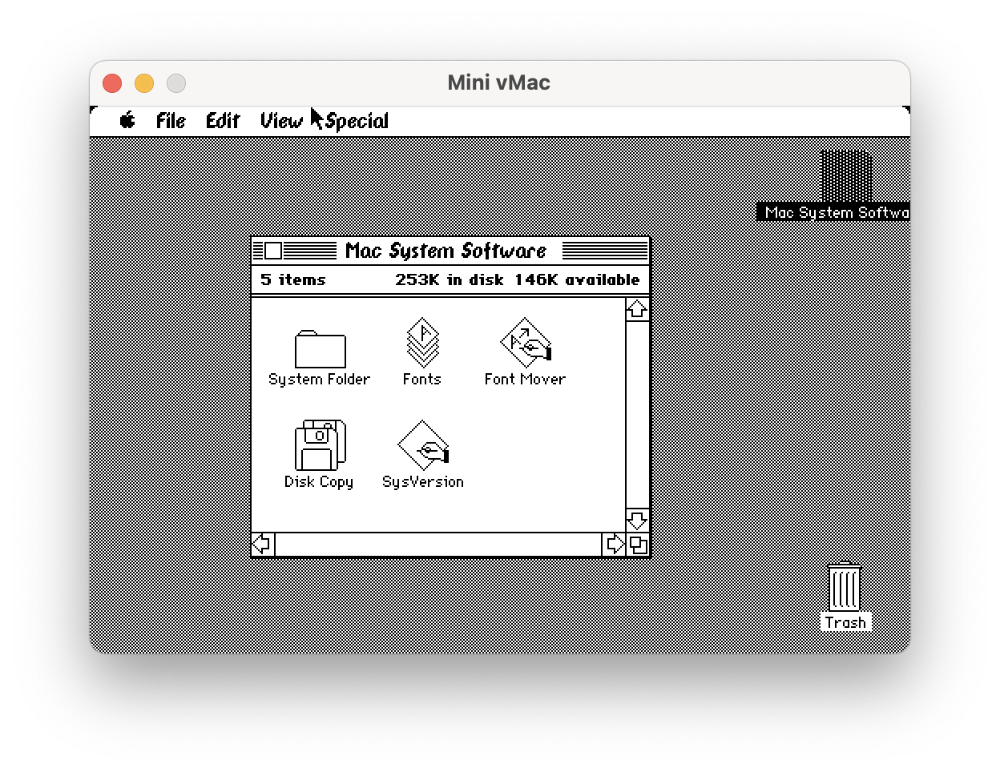

# Mini vMac Universal

A universal macOS application that combines multiple Mini vMac emulator variations compiled from unmodified [minivmac source](https://github.com/minivmac/minivmac) into a single universal binary. This project demonstrates a collection of techniques for consolidating various Mini vMac variations into one application, enabling better code reuse and simplifying maintenance.



## Overview

Mini vMac traditionally requires separate compilation for each emulated machine model, using preprocessor directives for conditional compilation. Each emulated machine model requires specific configuration headers since different Macintosh models had different hardware capabilities. The configuration headers, usually generated by the minivmac setup tool for a specific Macintosh model and user parameters, defined a collection of constants required to compile the desired version of the emulator. These constants can specify various aspects of the emulator's configuration like screen dimensions and color depth, ROM size, sound capabilities, and disk drive features.

Traditionally, this means distributing separate applications for each model variation. This project demonstrates a collection of techniques for combining various Mini vMac variations compiled from unmodified minivmac source into a single universal Mac binary.

## Supported Models

The application supports emulating the following Macintosh models:
- Macintosh 128K
- Macintosh 512Ke
- Macintosh Plus
- Macintosh SE
- Macintosh II
- Macintosh SE FDHD
- Macintosh Classic

## Building

1. Initialize and update submodules to fetch the latest `minivmac` source:
   ```bash
   git submodule update --init --recursive
   ```

2. Generate model-specific configurations:
   ```bash
   cd Setup
   ./setup.sh
   ```
   
Model-specific configurations are generated during setup and stored in the `/Configuration` directory. Each model has its own set of headers that define model-specific compilation flags, the principal class name, and the bundle's display name.

3. Open the Xcode project and build the universal application target.

## Usage

The application is a native AppKit application that requires specific launch arguments to execute. These parameters must be configured in Xcode:

- In Xcode, navigate to Product > Scheme > Edit Scheme.
- Click on the “Run” button in the sidebar.
- Select the “Arguments” tab.
- Under “Arguments Passed On Launch,” specify the following parameters:

    - `-emulator <model>` - Specify the emulator variant to use (e.g., “Macintosh 128K” for Macintosh 128K).
    - `-rom <path>` - Provide the full path to the ROM file corresponding to the selected model.
    - `-disks <paths>` - Enter a list of paths to disk images that need to be mounted.

## Architecture

### Framework-based Variations

Each model variation is compiled into a separate framework, sharing the same source code but using distinct configuration headers. This approach ensures compatibility with Mini vMac’s model-specific compilation requirements, allows code reuse across variations, and makes updating minivmac from source easier by not requiring any modifications to it outside the generated .m file.

### Dynamic Loading

The universal application dynamically loads the appropriate framework based on the requested emulator model (see the `-emulator` argument). The general approach is as follows:

1. Parse command-line arguments to determine the requested model. In a more sophisticated project, this may be determined automatically by verifying the checksum of the supplied ROM file, and / or allow for a GUI based configuration by the user at runtime.
2. Load the corresponding framework.
3. Instantiate the emulator using the framework's principal class, which all conform to a common protocol.
4. Dispatch the mounting of any specified disk images.
5. Start the emulation by calling one of the methods (`-start`) on the emulator object.

## Requirements

- macOS 10.13 or later
- ROM file(s) for the model(s) you would like to emulate
- Disk images compatible with the model(s)

## Further Reading

I've written a detailed blog post, outlining the step-by-step process of setting up this project. See [Building a Universal Mini vMac Application](https://philz.blog/building-universal-mini-vmac-macos-application/).

## Acknowledgments

- [Mini vMac](https://www.gryphel.com/c/minivmac/)
- [vMac](http://vmac.org)
